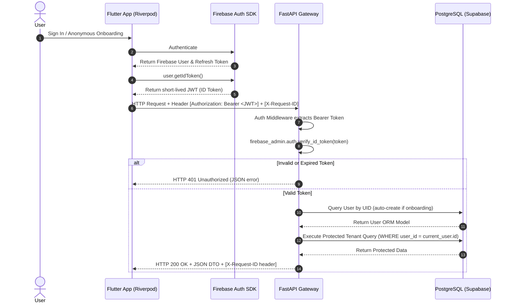

# Phase 1: Real Backend, Database, Auth & Foundational Engineering Architecture Plan

**Date:** July 6, 2026  
**Project:** Nova AI Commercial MVP  
**Baseline Git Commit:** `dad713a28d48a68c8dbc50ab317a531a30674ffc`  
**Status:** **PROPOSED (Waiting for User Approval)**

---

## A. Current Repository State
1. **Local Git Repository:** Successfully initialized (`.git/`).
2. **Clean Baseline Commit:** Created initial baseline commit representing the verified, zero-secret Phase 0 state.
   - **Commit Hash:** `dad713a28d48a68c8dbc50ab317a531a30674ffc`
   - **Commit Message:** `chore(baseline): verified Phase 0 security cleanup baseline`
   - **Tracked Files:** `181` files across `pubspec.yaml`, `lib/`, `assets/`, `web/`, `ios/`, `android/`, `macos/`, `linux/`, `windows/`, and `test/`.
   - **Working Tree Status:** `On branch master / nothing to commit, working tree clean`.
3. **Remote Setup Status:** Per guardrail #6, zero remote GitHub repositories have been created or connected. The repository remains purely local pending explicit user approval.
4. **Secret Scan Verification:** Re-verified via `python tests/test_secret_leakage.py` (`OK`, 0 violations).

---

## B. Proposed Phase 1 Architecture
Phase 1 transforms Nova AI from a local, simulated client into a production-grade, multi-tenant Digital Human platform:
- **Client Application:** Flutter + Riverpod + GoRouter. Replaces SharedPreferences with `flutter_secure_storage` for storing ephemeral user session tokens. Communicates exclusively via REST (`NovaApiService` using Dio/HTTP) to the backend gateway.
- **Backend Gateway:** FastAPI with Python 3.11+ running in an async monorepo subdirectory (`apps/api/`). Orchestrates AI provider calls, Pydantic schema validation, Server-Sent Events (SSE) streaming chat, and JWT authentication middleware.
- **Primary Database:** PostgreSQL 15+ with `pgvector` extension hosted on Supabase (or running in local Docker for offline dev).
- **Migration Engine:** Alembic with async SQLAlchemy 2.0 (`asyncpg` driver) for declarative schema evolution.
- **Authentication Gateway:** Firebase Authentication (Anonymous onboarding, Google/Apple Sign-In). Issuing Firebase ID tokens (JWTs) verified on every API request by FastAPI middleware using `firebase-admin`.
- **Local Offline Cache:** Drift (SQLite) on the Flutter client for offline chat log caching and reconnect sync queues.
- **AI Access Protocol:** Google Gemini accessed **ONLY** through the FastAPI backend via an `AIProvider` abstraction. Zero LLM keys or direct AI network requests exist in the Flutter app.

---

## C. Exact Directory and File Structure
```text
new app nova ai/
├── .git/                      # Local Git repository (Baseline: dad713a2)
├── .env.example               # Client environment template
├── .gitignore                 # Excludes secrets, .env*, *.zip, *_dump.txt
├── pubspec.yaml               # Flutter client dependencies
├── lib/                       # Flutter client source code
│   ├── core/
│   │   ├── router.dart
│   │   └── http_client.dart   # [NEW] HTTP/Dio client with JWT Bearer interceptor
│   ├── models/                # Pydantic-aligned Dart data models
│   ├── providers/
│   │   ├── auth_provider.dart # [NEW] Riverpod authentication state notifier
│   │   └── ...
│   ├── repositories/
│   │   ├── auth_repository.dart # [NEW] Firebase auth client wrapper
│   │   └── ...
│   └── services/
│       ├── nova_api_service.dart # [NEW] REST client communicating with FastAPI
│       └── ...
└── apps/                      # [NEW] Backend monorepo directory
    └── api/
        ├── .env.example       # Backend environment template (GEMINI_API_KEY, DATABASE_URL)
        ├── pyproject.toml / requirements.txt
        ├── alembic.ini        # Alembic migration configuration
        ├── alembic/           # Database migration environment
        │   ├── env.py         # Async SQLAlchemy Alembic runner
        │   └── versions/      # Versioned SQL migration scripts
        ├── src/
        │   ├── __init__.py
        │   ├── main.py        # FastAPI app initialization, CORS, & middleware
        │   ├── config.py      # Pydantic Settings (environment loading & validation)
        │   ├── database.py    # Async SQLAlchemy engine & session dependency
        │   ├── dependencies.py # Shared dependencies (get_db, get_current_user)
        │   ├── exceptions.py  # Centralized custom exceptions & error formatting
        │   ├── logging.py     # Structured JSON logging & X-Request-ID propagation
        │   ├── models/        # SQLAlchemy ORM tables (User, Companion, Message, SystemSettings)
        │   ├── schemas/       # Pydantic request & response validation schemas
        │   ├── services/      # Business logic & external provider integrations
        │   │   ├── ai_provider.py # Abstract AIProvider & Google Gemini implementation
        │   │   └── auth_service.py # Firebase JWT ID token verification
        │   └── routers/       # API endpoints
        │       ├── health.py  # /api/v1/health/liveness and /readiness
        │       ├── auth.py    # /api/v1/auth/sync and onboarding
        │       ├── companions.py # /api/v1/companions CRUD & creation
        │       └── chat.py    # /api/v1/conversations/{id}/messages/stream (SSE)
        └── tests/             # Pytest automated verification suite
            ├── conftest.py    # Pytest fixtures (in-memory DB, mock auth, AsyncClient)
            ├── test_health.py
            ├── test_auth.py
            ├── test_companions.py
            ├── test_chat_stream.py
            └── test_migrations.py
```

---

## D. Database Architecture
The backend uses PostgreSQL with the `pgvector` extension for semantic embedding storage.
1. **`users` Table:**
   - `id` (UUID, Primary Key matching Firebase UID), `email` (Varchar), `display_name` (Varchar), `created_at` (Timestamptz), `updated_at` (Timestamptz), `status` (Enum: `ACTIVE`, `SUSPENDED`, `DELETING`).
2. **`companions` Table:**
   - `id` (UUID, Primary Key), `user_id` (UUID, Foreign Key -> `users.id`, Indexed for tenant isolation), `name` (Varchar), `tagline` (Varchar), `bio` (Text), `avatar_url` (Varchar), `personality_traits` (JSONB), `system_prompt` (Text), `created_at` (Timestamptz), `updated_at` (Timestamptz).
3. **`messages` Table:**
   - `id` (UUID, Primary Key), `conversation_id` (UUID, Indexed), `companion_id` (UUID, Foreign Key -> `companions.id`), `user_id` (UUID, Foreign Key -> `users.id`), `role` (Enum: `user`, `assistant`), `content` (Text), `created_at` (Timestamptz), `embedding` (`vector(768)` for Gemini embeddings).
4. **`system_settings` Table (No Redis Kill Switch):**
   - `key` (Varchar, Primary Key), `value` (Varchar), `updated_at` (Timestamptz), `updated_by` (Varchar). Holds `AI_EMERGENCY_KILL_SWITCH = 'true'|'false'`.
5. **`usage_records` Table:**
   - `id` (UUID, Primary Key), `user_id` (UUID), `companion_id` (UUID), `prompt_tokens` (Integer), `completion_tokens` (Integer), `total_cost_usd` (Numeric), `timestamp` (Timestamptz).

---

## E. Authentication Flow


---

## F. Security Boundaries & Foundational Engineering
1. **Secret Ownership & Boundaries:**
   - **Flutter Client:** Untrusted boundary. Never stores Gemini API keys, Supabase Service Role keys, or database connection strings. Only holds ephemeral Firebase user JWTs and public API base URLs.
   - **FastAPI Backend:** Trusted boundary. Holds all secret credentials (`GEMINI_API_KEY`, `DATABASE_URL`, `FIREBASE_SERVICE_ACCOUNT_JSON`) injected via environment variables (`apps/api/.env`).
2. **CORS & Trusted-Origin Policy:**
   - Explicitly configured via `CORSMiddleware`.
   - Wildcard (`allow_origins=["*"]`) is strictly forbidden in production.
   - Allowed Origins: `https://app.nova.ai`, `capacitor://localhost`, and local development ports (`http://localhost:8088`, `http://localhost:3000`).
   - Allowed Methods: `GET`, `POST`, `PUT`, `DELETE`, `OPTIONS`.
   - Allowed Headers: `Authorization`, `Content-Type`, `X-Request-ID`.
3. **Structured Logging & Correlation ID Propagation:**
   - Every incoming HTTP request is assigned or extracts a unique `X-Request-ID` UUID.
   - All backend log outputs are formatted as structured JSON including `timestamp`, `level`, `x_request_id`, `method`, `path`, `status_code`, and `duration_ms`.
   - If an exception occurs, the correlation ID is included in both the server logs and the client error JSON.
4. **Centralized Exception Handling & Standard API Error Schema:**
   - All errors return a standardized JSON structure:
     ```json
     {
       "error": {
         "code": "RATE_LIMIT_EXCEEDED",
         "message": "Too many requests. Please try again later.",
         "request_id": "req_01h8x9p3z7v2k8q5",
         "timestamp": "2026-07-06T18:20:00Z"
       }
     }
     ```
5. **Rate Limiting, Timeout & Request Size Limits:**
   - Rate limits enforced via SlowAPI / Redis-free memory limiter (50 requests/min per user on Free tier).
   - Max request body size capped at 10MB.
   - Streaming connection timeout: 5.0s handshake, 45.0s max stream duration.
6. **Health & Readiness Endpoints:**
   - `/api/v1/health/liveness`: Instant memory check (`{"status": "ok"}`).
   - `/api/v1/health/readiness`: Queries PostgreSQL `SELECT 1` and checks AI provider reachability (`{"status": "ready", "db": "ok", "ai": "ok"}`).
7. **Graceful Shutdown Behavior:**
   - On `SIGTERM` / `SIGINT`, FastAPI stops accepting new requests, allows in-flight SSE streams up to 10 seconds to finish cleanly, closes async database connection pools (`engine.dispose()`), and exits.

---

## G. Local Development Workflow (No Paid Cloud Required)
1. **Database:** Launch local PostgreSQL 15 container with pgvector using Docker Compose:
   ```bash
   docker run -d --name nova-postgres -e POSTGRES_PASSWORD=postgres -e POSTGRES_DB=nova_ai -p 5432:5432 ankane/pgvector:latest
   ```
2. **Backend Gateway:**
   ```bash
   cd apps/api
   python -m venv venv && source venv/bin/activate
   pip install -r requirements.txt
   alembic upgrade head
   uvicorn src.main:app --reload --port 8000
   ```
3. **Flutter Client:**
   ```bash
   flutter run -d chrome --dart-define=NOVA_API_BASE_URL=http://localhost:8000 --web-port=8088
   ```
4. **Auth Testing:** Use Firebase Auth Emulator running locally on port 9099 or mock JWT test headers.

---

## H. Production Deployment Options & Estimated Costs
| Component | Preferred Technology / Hosting | Tier / Option | Estimated Monthly Cost (MVP) |
| :--- | :--- | :--- | :--- |
| **Backend Gateway** | Google Cloud Run (Serverless Container) | Autoscaling 0 to N instances | **$0 – $15 / mo** (Generous free tier allowances) |
| **Primary Database** | Supabase PostgreSQL + pgvector | Pro Plan (or Free Tier up to 500MB) | **$0 – $25 / mo** |
| **Media Storage** | Supabase Storage (S3 compatible) | Consolidated under Supabase project | **Included in Supabase tier** |
| **Authentication** | Firebase Authentication | Free up to 50,000 Monthly Active Users | **$0 / mo** |
| **Push / Analytics** | Firebase Cloud Messaging & Crashlytics | Unlimited Free | **$0 / mo** |
| **AI LLM Provider** | Google Gemini API (Gemini 1.5 Flash / Pro) | Pay-as-you-go based on token consumption | **~$5 – $20 / mo** (Hard billing cap configured in GCP) |
| **Total Estimated Cost** | | | **~$5 – $60 / mo maximum** |

---

## I. File-by-File Change List (Planned Phase 1 Execution)
### Modified Files
- `pubspec.yaml`: Add dependencies (`firebase_core`, `firebase_auth`, `dio` or `http`, `flutter_secure_storage`).
- `lib/main.dart`: Initialize Firebase and provide Riverpod `authProvider`.
- `lib/providers/chat_provider.dart`: Transition from simulated local responses to streaming REST SSE via `NovaApiService`.
- `lib/providers/companion_provider.dart`: Transition from hardcoded mock list to fetching from `/api/v1/companions`.

### Created Files
- `lib/core/http_client.dart`: Dio/HTTP client with auth token interceptors and `X-Request-ID` injection.
- `lib/services/nova_api_service.dart`: REST service client connecting Flutter to FastAPI.
- `lib/providers/auth_provider.dart`: Riverpod authentication state manager.
- `apps/api/*`: Complete FastAPI project structure (app root, models, schemas, routers, middleware, Alembic migrations, and Pytest test suite as listed in Section C).

---

## J. Exact Dependencies and Pinned Versions
### Flutter Client (`pubspec.yaml`)
```yaml
dependencies:
  flutter:
    sdk: flutter
  flutter_riverpod: ^3.3.2
  go_router: ^17.3.0
  google_fonts: ^8.1.0
  firebase_core: ^3.10.0
  firebase_auth: ^5.4.0
  dio: ^5.7.0
  flutter_secure_storage: ^9.2.2
```

### FastAPI Backend (`apps/api/requirements.txt`)
```text
fastapi==0.115.6
uvicorn[standard]==0.34.0
pydantic==2.10.4
pydantic-settings==2.7.0
sqlalchemy[asyncio]==2.0.36
asyncpg==0.30.0
alembic==1.14.0
firebase-admin==6.6.0
google-generativeai==0.8.3
httpx==0.28.0
slowapi==0.1.9
pytest==8.3.4
pytest-asyncio==0.24.0
```

---

## K. Test Strategy
1. **Backend Unit & Integration Tests (`pytest`):**
   - Run in an isolated test environment with an in-memory or ephemeral test database.
   - Verify health check responses (`test_health.py`).
   - Verify JWT authentication rejection for missing/invalid Bearer tokens and user creation on valid tokens (`test_auth.py`).
   - Verify multi-tenant row ownership: assert that User A requesting User B's companion returns `HTTP 403/404` (`test_row_ownership.py`).
   - Verify Server-Sent Events (SSE) chat stream formatting and cancellation (`test_chat_stream.py`).
   - Verify Alembic migrations cleanly apply from zero to latest (`test_migrations.py`).
2. **Client Unit & Widget Tests (`flutter test`):**
   - Mock `NovaApiService` to verify Riverpod state transitions during loading, success, and network error states.
   - Maintain 100% pass rate across existing security and route smoke tests.

---

## L. Executable Acceptance Criteria
Phase 1 execution will be verified against Criteria 1.1 through 1.28 as defined in the master verification matrix:
- **Health:** `curl -i http://localhost:8000/api/v1/health/liveness` -> HTTP 200 OK.
- **Database & pgvector:** `psql -U postgres -d nova_ai -c "SELECT extname FROM pg_extension WHERE extname='vector';"` -> Returns `vector`.
- **Migrations:** `alembic upgrade head` -> Exit code 0.
- **Security & Tenant Isolation:** `pytest tests/backend/test_row_ownership.py` -> 100% pass.
- **AI Kill Switch:** `UPDATE system_settings SET value = 'true' WHERE key = 'AI_EMERGENCY_KILL_SWITCH';` -> Asserts immediate HTTP 503 response without calling Gemini.
- **Client Build:** `flutter analyze && flutter test` -> 0 errors, all tests passing.

---

## M. Rollback Strategy
1. **Version Control Rollback:**
   - Because we created the clean baseline commit `dad713a28d48a68c8dbc50ab317a531a30674ffc`, if Phase 1 execution encounters critical architectural roadblocks or corrupts project state, we can instantly reset the entire project to the clean baseline:
     ```bash
     git reset --hard dad713a28d48a68c8dbc50ab317a531a30674ffc
     git clean -fd
     ```
2. **Database Schema Rollback:**
   - Every Alembic migration includes an explicit `downgrade()` method. To roll back a database migration:
     ```bash
     alembic downgrade -1
     ```

---

## N. Decisions and Actions Required from User
Before we execute Phase 1 code creation, please review and approve:
1. **Approve Git Baseline:** Confirm you approve the local baseline commit (`dad713a28d48a68c8dbc50ab317a531a30674ffc`).
2. **Approve Remote GitHub Setup Strategy:** Confirm whether you want me to create/connect a remote private GitHub repository now or keep it strictly local for Phase 1 development.
3. **Approve Phase 1 Architecture Plan:** Review and confirm this blueprint so we can begin creating `apps/api/` and adding client authentication.
4. **Required User Actions (When Phase 1 Execution Starts):**
   - Create a free Firebase project in the Firebase Console (for Auth & FCM).
   - Create a Supabase project (or install local Docker) to obtain the PostgreSQL connection string (`DATABASE_URL`).
   - Provide a new Google Gemini API key (`GEMINI_API_KEY`) to be placed in `apps/api/.env` (never committed to Git).

---

## O. Risks, Assumptions, and Unresolved Questions
- **Risk 1:** SSE streaming over mobile networks can experience buffering or timeout disconnects.  
  *Mitigation:* The FastAPI SSE router will emit periodic heartbeat comments (`: ping\n\n`) every 15 seconds to keep cellular connections alive.
- **Risk 2:** Cross-tenant data leakage if ORM queries omit user filtering.  
  *Mitigation:* Repository pattern enforces that all data queries must append `.where(Model.user_id == current_user.id)`. Automated Pytest multi-tenant suites will gate CI builds.
- **Assumption:** Local development uses Python 3.11+ and Docker Desktop (for local PostgreSQL/pgvector) or a free cloud Supabase database.
- **Unresolved Question:** For media object storage (companion avatars and voice clips), do you prefer using **Supabase Storage** (consolidating with the database) or **Google Cloud Storage**? (ADR-001 recommended Supabase Storage).
